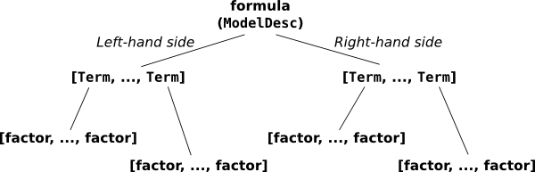
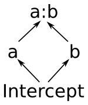
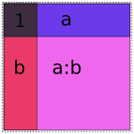

.. _formulas:

How formulas work
=================

.. currentmodule:: patsy

.. ipython:: python
   :suppress:

   import numpy as np
   from patsy import *

Now we'll describe the full nitty-gritty of how formulas are parsed
and interpreted. Here's the picture you'll want to keep in mind:

   
   The pieces that make up a formula.

Say we have a formula like::

  y ~ a + a:b + np.log(x)

This overall thing is a **formula**, and it's divided into a left-hand
side, ``y``, and a right-hand side, ``a + a:b +
np.log(x)``. (Sometimes you want a formula that has no left-hand
side, and you can write that as ``~ x1 + x2`` or even ``x1 + x2``.)
Each side contains a list of **terms** separated by ``+``; on the left
there is one term, ``y``, and on the right, there are four terms:
``a`` and ``a:b`` and ``np.log(x)``, plus an invisible intercept
term. And finally, each term is the interaction of zero or more
**factors**. A factor is the minimal, indivisible unit that each
formula is built up out of; the factors here are ``y``, ``a``, ``b``,
and ``np.log(x)``. Most of these terms have only one factor -- for
example, the term ``y`` is a kind of trivial interaction between the
factor ``y`` and, well... and nothing. There's only one factor in that
"interaction". The term ``a:b`` is an interaction between two factors,
``a`` and ``b``. And the intercept term is an interaction between
*zero* factors. (This may seem odd, but it turns out that defining the
zero-order interaction to produce a column of all ones is very
convenient, just like it turns out to be convenient to define the
`product of an empty list
<https://en.wikipedia.org/wiki/Empty_product>`_ to be ``np.prod([]) ==
1``.)

.. note::

   In the context of Patsy, the word **factor** does *not* refer
   specifically to categorical data. What we call a "factor" can
   represent either categorical or numerical data. Think of factors
   like in multiplying factors together, not like in factorial
   design. When we want to refer to categorical data, this manual and
   the Patsy API use the word "categorical".

To make this more concrete, here's how you could manually construct
the same objects that Patsy will construct if given the above
formula::

  from patsy import ModelDesc, Term, EvalFactor
  ModelDesc([Term([EvalFactor("y")])],
            [Term([]),
             Term([EvalFactor("a")]),
             Term([EvalFactor("a"), EvalFactor("b")]),
             Term([EvalFactor("np.log(x)")])
             ])

Compare to what you get from parsing the above formula::

  ModelDesc.from_formula("y ~ a + a:b + np.log(x)")

:class:`ModelDesc` represents an overall formula; it just takes two
lists of :class:`Term` objects, representing the left-hand side and
the right-hand side. And each ``Term`` object just takes a list of
factor objects. In this case our factors are of type
:class:`EvalFactor`, which evaluates arbitrary Python code, but in
general any object that implements the factor protocol will do -- for
details see :ref:`expert-model-specification`.

Of course as a user you never have to actually touch
:class:`ModelDesc`, :class:`Term`, or :class:`EvalFactor` objects by
hand -- but it's useful to know that this lower layer exists in case
you ever want to generate a formula programmatically, and to have an
image in your mind of what a formula really is.

.. _formulas-language:

The formula language
--------------------

Now let's talk about exactly how those magic formula strings are
processed.

Since a term is nothing but a set of factors, and a model is nothing
but two sets of terms, you can write any Patsy model just using
``:`` to create interactions, ``+`` to join terms together into a set,
and ``~`` to separate the left-hand side from the right-hand side.
But for convenience, Patsy also understands a number of other
short-hand operators, and evaluates them all using a `full-fledged
parser <http://en.wikipedia.org/wiki/Shunting_yard_algorithm>`_
complete with robust error reporting, etc.

Operators
^^^^^^^^^

The built-in binary operators, ordered by precedence, are:

============  =======================================
``~``         lowest precedence (binds most loosely)
``+``, ``-``
``*``, ``/``
``:``
``**``        highest precedence (binds most tightly)
============  =======================================

Of course, you can override the order of operations using
parentheses. All operations are left-associative (so ``a - b - c`` means
the same as ``(a - b) - c``, not ``a - (b - c)``). Their meanings are as
follows:

``~``
  Separates the left-hand side and right-hand side of a
  formula. Optional. If not present, then the formula is considered to
  contain a right-hand side only.

``+``
  Takes the set of terms given on the left and the set of terms given
  on the right, and returns a set of terms that combines both (i.e.,
  it computes a set union). Note that this means that ``a +
  a`` is just ``a``.

``-``
  Takes the set of terms given on the left and removes any terms which
  are given on the right (i.e., it computes a set difference).

``*``
  ``a * b`` is short-hand for ``a + b + a:b``, and is useful for the
  common case of wanting to include all interactions between a set of
  variables while partitioning their variance between lower- and
  higher-order interactions. Standard ANOVA models are of the form
  ``a * b * c * ...``.

``/``
  This one is a bit quirky. ``a / b`` is shorthand for ``a + a:b``,
  and is intended to be useful in cases where you want to fit a
  standard sort of ANOVA model, but ``b`` is nested within ``a``, so
  ``a*b`` doesn't make sense. So far so good. Also, if you have
  multiple terms on the right, then the obvious thing happens: ``a /
  (b + c)`` is equivalent to ``a + a:b + a:c`` (``/`` is rightward
  `distributive
  <https://en.wikipedia.org/wiki/Distributive_property>`_ over
  ``+``). *But,* if you have multiple terms on the left, then there is
  a surprising special case: ``(a + b)/c`` is equivalent to ``a + b +
  a:b:c`` (and note that this is different from what you'd get out of
  ``a/c + b/c`` -- ``/`` is *not* leftward distributive over
  ``+``). Again, this is motivated by the idea of using this for
  nested variables. It doesn't make sense for ``c`` to be nested
  within both ``a`` and ``b`` separately, unless ``b`` is itself
  nested in ``a`` -- but if that were true, then you'd write ``a/b/c``
  instead. So if we see ``(a + b)/c``, we decide that ``a`` and ``b``
  must be independent factors, but that ``c`` is nested within each
  *combination* of levels of ``a`` and ``b``, which is what ``a:b:c``
  gives us. If this is confusing, then my apologies... S has been
  working this way for >20 years, so it's a bit late to change it
  now.

``:``
  This takes two sets of terms, and computes the interaction between
  each term on the left and each term on the right. So, for example,
  ``(a + b):(c + d)`` is the same as ``a:c + a:d + b:c +
  b:d``. Calculating the interaction between two terms is also a kind
  of set union operation, but ``:`` takes the union of factors *within*
  two terms, while ``+`` takes the union of two sets of terms. Note that
  this means that ``a:a`` is just ``a``, and ``(a:b):(a:c)`` is the same as
  ``a:b:c``.

``**``
  This takes a set of terms on the left, and an integer *n* on the
  right, and computes the ``*`` of that set of terms with itself *n*
  times. This is useful if you want to compute all interactions up to
  order *n*, but no further. Example::

   (a + b + c + d) ** 3

  is expanded to::

   (a + b + c + d) * (a + b + c + d) * (a + b + c + d)

  Note that an equivalent way to write this particular expression
  would be::

   a*b*c*d - a:b:c:d

  (*Exercise:* why?)

The parser also understands unary ``+`` and ``-``, though they aren't very
useful. ``+`` is a no-op, and ``-`` can only be used in the forms ``-1``
(which means the same as ``0``) and ``-0`` (which means the same as
``1``). See :ref:`below <intercept-handling>` for more on ``0`` and
``1``.

Factors and terms
^^^^^^^^^^^^^^^^^

So that explains how the operators work -- the verbs in the formula
language -- but what about the nouns, the terms like ``y`` and
``np.log(x)`` that are actually picking out bits of your data?

Individual factors are allowed to be arbitrary Python code. Scanning
arbitrary Python code can be quite complicated, but Patsy uses the
official Python tokenizer that's built into the standard library, so
it's able to do it robustly. There is still a bit of a problem,
though, since Patsy operators like ``+`` are also valid Python
operators. When we see a ``+``, how do we know which interpretation to
use?

The answer is that a Python factor begins whenever we see a token
which

* is not a Patsy operator listed in that table up above, and
* is not a parenthesis

And then the factor ends whenever we see a token which

* is a Patsy operator listed in that table up above, and
* it not enclosed in any kind of parentheses (where "any kind"
  includes regular, square, and curly bracket varieties)

This will be clearer with an example::

  f(x1 + x2) + x3

First, we see ``f``, which is not an operator or a parenthesis, so we
know this string begins with a Python-defined factor. Then we keep
reading from there. The next Patsy operator we see is the ``+`` in
``x1 + x2``... but since at this point we have seen the opening ``(``
but not the closing ``)``, we know that we're inside parentheses and
ignore it. Eventually we come to the second ``+``, and by this time we
have seen the closing parentheses, so we know that this is the end of
the first factor and we interpret the ``+`` as a Patsy operator.

One side-effect of this is that if you do want to perform some
arithmetic inside your formula object, you can hide it from the
Patsy parser by putting it inside a function call. To make this
more convenient, Patsy provides a builtin function :func:`I`
that simply returns its input. (Hence the name: it's the Identity
function.) This means you can use ``I(x1 + x2)`` inside a formula to
represent the sum of ``x1`` and ``x2``.

.. note::

   The above plays a bit fast-and-loose with the distinction
   between factors and terms. If you want to get more technical, then
   given something like ``a:b``, what's happening is first that we
   create a factor ``a`` and then we package it up into a
   single-factor term. And then we create a factor ``b``, and we
   package it up into a single-factor term. And then we evaluate the
   ``:``, and compute the interaction between these two terms. When
   we encounter embedded Python code, it's always converted straight
   to a single-factor term before doing anything else.

.. _intercept-handling:

Intercept handling
^^^^^^^^^^^^^^^^^^

There are two special things about how intercept terms are handled
inside the formula parser.

First, since an intercept term is an interaction of zero factors, we
have no way to write it down using the parts of the language described
so far. Therefore, as a special case, the string ``1`` is taken to
represent the intercept term.

Second, since intercept terms are almost always wanted and remembering
to include them by hand all the time is quite tedious, they are always
included by default in the right-hand side of any formula. The way
this is implemented is exactly as if there is an invisible ``1 +``
inserted at the beginning of every right-hand side.

Of course, if you don't want an intercept, you can remove it again
just like any other unwanted term, using the ``-`` operator. The only
thing that's special about the ``1 +`` is that it's invisible;
otherwise it acts just like any other term. This formula has an
intercept::

  y ~ x

because it is processed like ``y ~ 1 + x``.

This formula does not have an intercept::

  y ~ x - 1

because it is processed like ``y ~ 1 + x - 1``.

Of course if you want to be really explicit you can mention the
intercept explicitly::

  y ~ 1 + x

Once the invisible ``1 +`` is added, this formula is processed like
``y ~ 1 + 1 + x``, and as you'll recall from the definition of ``+``
above, adding the same term twice produces the same result as adding
it just once.

For compatibility with S and R, we also allow the magic terms ``0`` and
``-1`` which represent the "anti-intercept". Adding one of these terms
has exactly the same effect as subtracting the intercept term, and
subtracting one of these terms has exactly the same effect as adding
the intercept term. That means that all of these formulas are
equivalent::

  y ~ x - 1
  y ~ x + -1
  y ~ -1 + x
  y ~ 0 + x
  y ~ x - (-0)

Explore!
^^^^^^^^

The formula language is actually fairly simple once you get the hang
of it, but if you're ever in doubt as to what some construction means,
you can always ask Patsy how it expands.

Here's some code to try out at the Python prompt to get started::

  from patsy import ModelDesc
  ModelDesc.from_formula("y ~ x")
  ModelDesc.from_formula("y ~ x + x + x")
  ModelDesc.from_formula("y ~ -1 + x")
  ModelDesc.from_formula("~ -1")
  ModelDesc.from_formula("y ~ a:b")
  ModelDesc.from_formula("y ~ a*b")
  ModelDesc.from_formula("y ~ (a + b + c + d) ** 2")
  ModelDesc.from_formula("y ~ (a + b)/(c + d)")
  ModelDesc.from_formula("np.log(x1 + x2) "
                         "+ (x + {6: x3, 8 + 1: x4}[3 * i])")

Sometimes it might be easier to read if you put the processed formula
back into formula notation using :meth:`ModelDesc.describe`::

  desc = ModelDesc.from_formula("y ~ (a + b + c + d) ** 2")
  desc.describe()

.. _formulas-building:

From terms to matrices
----------------------

So at this point, you hopefully understand how a string is parsed into
the :class:`ModelDesc` structure shown in the figure at the top of
this page. And if you like you can also produce such structures
directly without going through the formula parser (see
:ref:`expert-model-specification`). But these terms and factors
objects are still a fairly high-level, symbolic representation of a
model. Now we'll talk about how they get converted into actual
matrices with numbers in.

There are two core operations here. The first takes a list of
:class:`Term` objects (a **termlist**) and some data, and produces a
:class:`DesignMatrixBuilder`. The second takes a
:class:`DesignMatrixBuilder` and some data, and produces a design
matrix. In practice, these operations are implemented by
:func:`design_matrix_builders` and :func:`build_design_matrices`,
respectively, and each of these functions is "vectorized" to process
an arbitrary number of matrices together in a single operation. But
we'll ignore that for now, and just focus on what happens to a single
termlist.

First, each individual factor is given a chance to set up any
:ref:`stateful-transforms` it may have, and then is evaluated on the
data, to determine:

* Whether it is categorical or numerical
* If it is categorical, what levels it has
* If it is numerical, how many columns it has.

Next, we sort terms based on the factors they contain. This is done by
dividing terms into groups based on what combination of numerical
factors each one contains. The group of terms that have no numerical
factors comes first, then the rest of the groups in the order they are
first mentioned within the term list. Then within each group,
lower-order interactions are ordered to come before higher-order
interactions. (Interactions of the same order are left alone.)

Example:

.. ipython:: python

   data = demo_data("a", "b", "x1", "x2")
   mat = dmatrix("x1:x2 + a:b + b + x1:a:b + a + x2:a:x1", data)
   mat.design_info.term_names

The non-numerical terms are `Intercept`, `b`, `a`, `a:b` and they come
first, sorted from lower-order to higher-order. `b` comes before `a`
because it did in the original formula. Next come the terms that
involved `x1` and `x2` together, and `x1:x2` comes before `x2:a:x1`
because it is a lower-order term. Finally comes the sole term
involving `x1` without `x2`.

.. note::

   These ordering rules may seem a bit arbitrary, but will make more
   sense after our discussion of redundancy below. Basically the
   motivation is that terms like `b` and `a` represent overlapping
   vector spaces, which means that the presence of one will affect how
   the other is coded. So, we group to them together, to make
   these relationships easier to see in the final analysis. And, a
   term like `b` represents a sub-space of a term like `a:b`, so if
   you're including both terms in your model you presumably want the
   variance represented by `b` to be partitioned out separately from
   the overall `a:b` term, and for that to happen, `b` should come
   first in the final model.

After sorting the terms, we determine appropriate coding schemes for
categorical factors, as described in the next section. And that's it
-- we now know exactly how to produce this design matrix, and
:func:`design_matrix_builders` packages this knowledge up into a
:class:`DesignMatrixBuilder` and returns it. To get the design matrix
itself, we then use :func:`build_design_matrices`.

.. _redundancy:

Redundancy and categorical factors
^^^^^^^^^^^^^^^^^^^^^^^^^^^^^^^^^^

Here's the basic idea about how Patsy codes categorical factors: each
term that's included means that we want our outcome variable to be
able to vary in a certain way -- for example, the `a:b` in ``y ~ a:b``
means that we want our model to be flexible enough to assign `y` a
different value for every possible combination of `a` and `b`
values. So what Patsy does is build up a design matrix incrementally
by working from left to right in the sorted term list, and for each
term it adds just the right columns needed to make sure that the model
will be flexible enough to include the kind of variation this term
represents, while keeping the overall design matrix full rank. The
result is that the columns associated with each term always represent
the *additional* flexibility that the models gains by adding that
term, on top of the terms to its left. Numerical factors are assumed
not to be redundant with each other, and are always included "as is";
categorical factors and interactions might be redundant, so Patsy
chooses either full-rank or reduced-rank contrast coding for each one
to keep the overall design matrix at full rank.

.. note::

   We're only worried here about "structural redundancies", those
   which occur inevitably no matter what the particular values occur
   in your data set. If you enter two different factors `x1` and `x2`,
   but set them to be numerically equal, then Patsy will indeed
   produce a design matrix that isn't full rank. Avoiding that is your
   problem.

Okay, now for the more detailed explanation. Each term
represents a certain space of linear combinations of column vectors:

* A numerical factor represents the vector space spanned by its
  columns.
* A categorical factor represents the vector space spanned by the
  columns you get if you apply "dummy coding".
* An interaction between two factors represents the vector space
  spanned by the element-wise products between vectors in the first
  factor's space with vectors in the second factor's space. For
  example, if :math:`c_{1a}` and :math:`c_{1b}` are two columns that
  form a basis for the vector space represented by factor :math:`f_1`,
  and likewise :math:`c_{2a}` and :math:`c_{2b}` are a basis for the
  vector space represented by :math:`f_2`, then :math:`c_{1a} *
  c_{2a}`, :math:`c_{1b} * c_{2a}`, :math:`c_{1a} * c_{2b}`,
  :math:`c_{1b}*c_{2b}` is a basis for the vector space represented
  by :math:`f_1:f_2`. Here the :math:`*` operator represents
  elementwise multiplication, like numpy ``*``. (*Exercise:* show that
  the choice of basis does not matter.)
* The empty interaction represents the space spanned by the identity
  element for elementwise multiplication, i.e., the all-ones
  "intercept" term.

So suppose that `a` is a categorical factor with two levels `a1` and
`a2`, and `b` is a categorical factor with two levels `b1` and `b1`.
Then:

* `a` represents the space spanned by two vectors: one that has a 1
  everywhere that ``a == "a1"``, and a zero everywhere else, and
  another that's similar but for ``a == "a2"``. (dummy coding)
* `b` works similarly
* and `a:b` represents the space spanned by *four* vectors: one that
  has a 1 everywhere that has ``a == "a1"`` and ``b == "b1"``, another
  that has a 1 everywhere that has ``a1 == "a2"`` and ``b == "b1"``,
  etc. So if you are familiar with ANOVA terminology, then these are
  *not* the kinds of interactions you are expecting! They represent a
  more fundamental idea, that when we write:

    y ~ a:b
  
  we mean that the value of `y` can vary depending on every possible
  *combination* of `a` and `b`.

Notice that this means that the space spanned by the intercept term is
always a vector subspace of the spaces spanned by `a` and `b`, and
these subspaces in turn are always subspaces of the space spanned by
`a:b`. (Another way to say this is that `a` and `b` are "marginal to"
`a:b`.) The diagram on the right shows these relationships
graphically. This reflects the intuition that allowing `y` to depend
on every combination of `a` and `b` gives you a more flexible model
than allowing it to vary based on just `a` or just `b`.

So what this means is that once you have `a:b` in your model, adding
`a` or `b` or the intercept term won't actually give you any
additional flexibility; the most they can do is to create redundancies
that your linear algebra package will have to somehow detect and
remove later. These two models are identical in terms of how flexible
they are::

   y ~ 0 + a:b
   y ~ 1 + a + b + a:b

And, indeed, we can check that the matrices that Patsy generates
for these two formulas have identical column spans:

.. ipython:: python

   data = demo_data("a", "b", "y")
   mat1 = dmatrices("y ~ 0 + a:b", data)[1]
   mat2 = dmatrices("y ~ 1 + a + b + a:b", data)[1]
   np.linalg.matrix_rank(mat1)
   np.linalg.matrix_rank(mat2)
   np.linalg.matrix_rank(np.column_stack((mat1, mat2)))

But, of course, their actual contents are different:

.. ipython:: python

   mat1
   mat2

This happens because Patsy is finding ways to avoid creating
redundancy while coding each term. To understand how this works, it's
useful to draw some pictures. Patsy has two general strategies for
coding a categorical factor with :math:`n` levels. The first is to use
a full-rank encoding with :math:`n` columns. Here are some pictures of
this style of coding:

.. container:: align-center

   |1| |a| |b| |a:b|

   .. |1| image:: figures/redundancy-1.png
   .. |a| image:: figures/redundancy-a.png
   .. |b| image:: figures/redundancy-b.png
   .. |a:b| image:: figures/redundancy-ab.png

Obviously if we lay these images on top of each other, they'll
overlap, which corresponds to their overlap when considered as vector
spaces. If we try just putting them all into the same model, we get
mud:

   Naive `1 + a + b + a:b`

Patsy avoids this by using its second strategy: coding an :math:`n`
level factor in :math:`n - 1` columns which, critically, do not span
the intercept. We'll call this style of coding *reduced-rank*, and use
notation like `a-` to refer to factors coded this way.

.. note::

   Each of the categorical coding schemes included in :mod:`patsy`
   come in both full-rank and reduced-rank flavours. If you ask for,
   say, :class:`Poly` coding, then this is the mechanism used to
   decide whether you get full- or reduced-rank :class:`Poly` coding.

For coding `a` there are two options:

.. container:: align-center

   |a| |a-|

   .. |a-| image:: figures/redundancy-ar.png

And likewise for `b`:

.. container:: align-center

   |b| |b-|

   .. |b-| image:: figures/redundancy-br.png

When it comes to `a:b`, things get more interesting: it can choose
whether to use a full- or reduced-rank encoding separately for each
factor, leading to four choices overall:

.. container:: align-center

   |a:b| |a-:b| |a:b-| |a-:b-|

   .. |a-:b| image:: figures/redundancy-arb.png
   .. |a:b-| image:: figures/redundancy-abr.png
   .. |a-:b-| image:: figures/redundancy-arbr.png

So when interpreting a formula like ``1 + a + b + a:b``, Patsy's
job is to pick and choose from the above pieces and then assemble them
together like a jigsaw puzzle.

Let's walk through the formula  ``1 + a + b + a:b`` to see how this
works. First it encodes the intercept:

.. container::

   .. image:: figures/redundancy-1.png
      :align: left

   .. ipython:: python

      dmatrices("y ~ 1", data)[1]

Then it adds the `a` term. It has two choices, either the full-rank
coding or the reduced rank `a-` coding. Using the full-rank coding
would overlap with the already-existing intercept term, though, so it
chooses the reduced rank coding:

.. container::

   .. image:: figures/redundancy-1-ar.png
      :align: left

   .. ipython:: python

      dmatrices("y ~ 1 + a", data)[1]

The `b` term is treated similarly:

.. container::

   .. image:: figures/redundancy-1-ar-br.png
      :align: left

   .. ipython:: python

      dmatrices("y ~ 1 + a + b", data)[1]

And finally, there are four options for the `a:b` term, but only one
of them will fit without creating overlap:

.. container::

   .. image:: figures/redundancy-1-ar-br-arbr.png
      :align: left

   .. ipython:: python

      dmatrices("y ~ 1 + a + b + a:b", data)[1]

Patsy tries to use the fewest pieces possible to cover the
space. For instance, in this formula, the `a:b` term is able to fill
the remaining space by using a single piece:

.. container::

   .. image:: figures/redundancy-1-br-arb.png
      :align: left

   .. ipython:: python

      dmatrices("y ~ 1 + b + a:b", data)[1]

However, this is not always possible. In such cases, Patsy will
assemble multiple pieces to code a single term [#R-brag]_, e.g.:

.. container::

   .. image:: figures/redundancy-1-br-arb-combined.png
      :align: left

   .. ipython:: python

      dmatrices("y ~ 1 + a:b", data)[1]

Notice that the matrix entries and column names here are identical to
those produced by the previous example, but the association between
terms and columns shown at the bottom is different.

In all of these cases, the final model spans the same space; `a:b` is
included in the formula, and therefore the final matrix must fill in
the full `a:b` square. By including different combinations of lower-order
interactions, we can control how this overall variance is
partitioned into distinct terms.

   *Exercise:* create the similar diagram for a formula that includes a
   three-way interaction, like ``1 + a + a:b + a:b:c`` or ``1 +
   a:b:c``. Hint: it's a cube. Then, send us your diagram for
   inclusion in this documentation [#shameless]_.

Finally, we've so far only discussed purely categorical
interactions. Bringing numerical interactions into the mix doesn't
make things much more complicated. Each combination of numerical
factors is considered to be distinct from all other combinations, so
we divide all of our terms into groups based on which numerical
factors they contain (just like we do when sorting terms, as described
above), and then within each group we separately apply the algorithm
described here to the categorical parts of each term.

Technical details
-----------------

The actual algorithm Patsy uses to produce the above coding is very
simple. Within the group of terms associated with each combination of
numerical factors, it works from left to right. For each term it
encounters, it breaks the categorical part of the interaction down
into minimal pieces, e.g. `a:b` is replaced by `1 + (a-) + (b-) +
(a-):(b-)`:

.. container:: align-center

   |a:b| |arrow| |1 a- b- a-:b-|

   .. |arrow| image:: figures/redundancy-arrow.png
   .. |1 a- b- a-:b-| image:: figures/redundancy-1-ar-br-arbr.png

(Formally speaking, these "minimal pieces" consist of the set of all
subsets of the original interaction.) Then, any of the minimal pieces
which were used by a previous term within this group are deleted,
since they are redundant:

.. container:: align-center

   |1 a- b- a-:b-| |arrow| |a- a-:b-|

   .. |a- a-:b-| image:: figures/redundancy-ar-arbr.png

and then we greedily recombine the pieces that are left
by repeatedly merging adjacent pieces according to the rule `ANYTHING
+ ANYTHING : FACTOR- = ANYTHING : FACTOR`:

.. container:: align-center

   |a- a-:b-| |arrow| |a-:b|

..

  *Exercise:* Prove formally that the space spanned by `ANYTHING +
  ANYTHING : FACTOR-` is identical to the space spanned by `ANYTHING :
  FACTOR`.

  *Exercise:* Either show that the greedy algorithm here produces
  optimal encodings in some sense (e.g., smallest number of pieces
  used), or else find a better algorithm. (Extra credit: implement
  your algorithm and submit a pull request [#still-shameless]_.)

Is this algorithm correct? A full formal proof would be too tedious
for this reference manual, but here's a sketch of the analysis.

Recall that our goal is to maintain two invariants: the design matrix
column space should include the space associated with each term, and
should avoid "structural redundancy", i.e. it should be full rank on
at least some data sets. It's easy to see the above algorithm will
never "lose" columns, since the only time it eliminates a subspace is
when it has previously processed that exact subspace within the same
design. But will it always detect all the redundancies that are
present?

That is guaranteed by the following theorem:

*Theorem:* Let two sets of factors, :math:`F = {f_1, \dots, f_n}` and
:math:`G = {g_1, \dots, g_m}` be given, and let :math:`F =
F_{\text{num}} \cup F_{\text{categ}}` be the numerical and categorical
factors, respectively (and similarly for :math:`G = G_{\text{num}}
\cup G_{\text{categ}}`. Then the space represented by the interaction
:math:`f_1 : \cdots : f_n` has a non-trivial intersection with the
space represented by the interaction :math:`g_1 : \cdots : g_m`
whenever:

* :math:`F_{\text{num}} = G_{\text{num}}`, and
* :math:`F_{\text{categ}} \cap G_{\text{categ}} \neq \emptyset`

And, furthermore, whenever this condition does not hold, then there
exists some assignment of values to the factors for which the
associated vector spaces have only a trivial intersection.

  *Exercise:* Prove it.

  *Exercise:* Show that given a sufficient number of rows, the set of
  factor assignments on which :math:`f_1 : \cdots : f_n` represents a
  subspace of :math:`g_1 : \cdots : g_n` without the above conditions
  being satisfied is actually a zero set.

Corollary: Patsy's strategy of dividing into groups by numerical
factors, and then comparing all subsets of the remaining categorical
factors, allows it to precisely identify and avoid structural
redundancies.

Footnotes
---------

.. [#R-brag] This is one of the places where Patsy improves on R,
   which produces incorrect output in this case (see
   :ref:`R-comparison`).

.. [#shameless] Yes, I'm lazy. And shameless.

.. [#still-shameless] Yes, still shameless.
