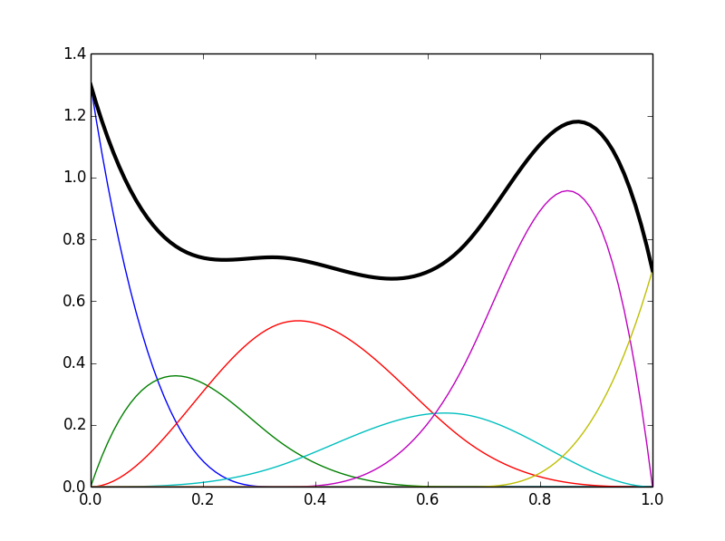
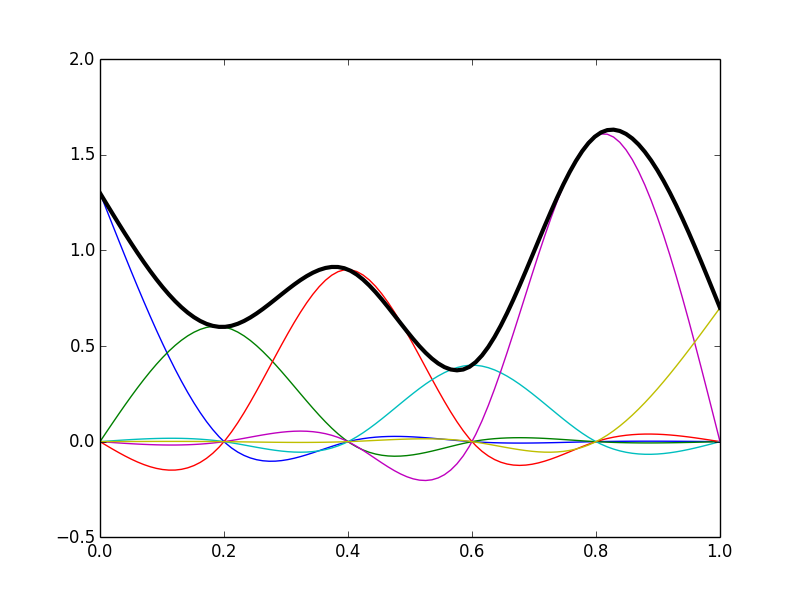
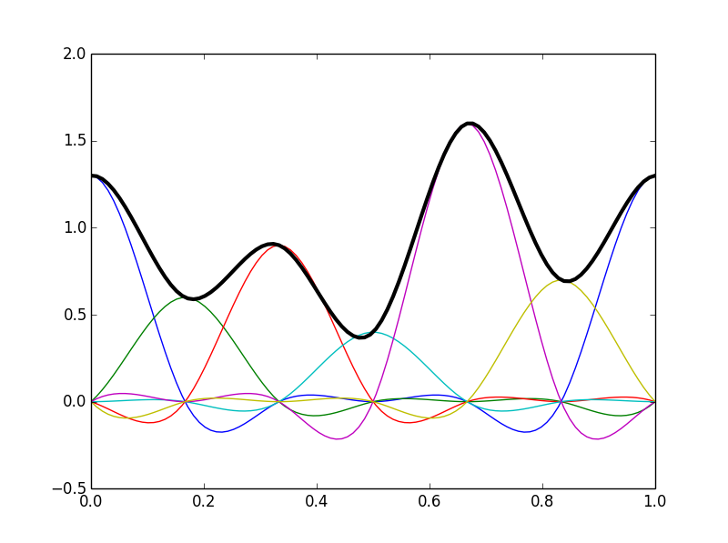
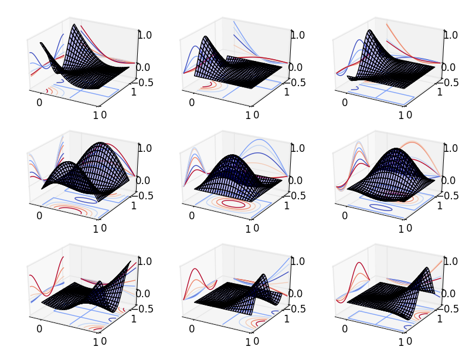

.. _spline-regression:

Spline regression
=================

.. currentmodule:: patsy

.. ipython:: python
   :suppress:

   import numpy as np
   from patsy import build_design_matrices, incr_dbuilder

Patsy offers a set of specific stateful transforms (for more details about
stateful transforms see :ref:`stateful-transforms`) that you can use in
formulas to generate splines basis and express non-linear fits.

B-splines
---------

B-spline basis can be generated with the :func:`bs` stateful transform.
The following figure illustrates a typical basis and the resulting spline:

   Illustration of (cubic) B-spline basis functions (colored curves) each multiplied
   by an associated coefficient, and the spline itself (sum of the basis
   functions, thick black curve). The basis functions were obtained
   using ``bs(x, df=6, degree=3, include_intercept=True)``.

In the following example we first set up our B-spline basis using some data and
then make predictions on a new set of data:

.. ipython:: python

   x = np.linspace(0., 1., 100)
   data_chunked = [{"x": x[:50]}, {"x": x[50:]}]

   builder = incr_dbuilder("bs(x, df=4)",
                           lambda: iter(data_chunked))

   new_x = np.array([0.1, 0.25, 0.9])
   new_data = {"x": new_x}
   design_matrix = build_design_matrices([builder], new_data)[0]
   design_matrix

Cubic regression splines
------------------------

Natural and cyclic cubic regression splines are provided through the stateful
transforms :func:`cr` and :func:`cc` respectively. Here the spline is
parameterized directly using its values at the knots. These splines are fully
compatible with those found in the R package
`mgcv <http://cran.r-project.org/web/packages/mgcv/index.html>`_
(these are called *cr*, *cs* and *cc* in the context of *mgcv*).
Note that the API is different from *mgcv*:

* In patsy one can specify the number of degrees of freedom directly (actual number of
  columns of the resulting design matrix) whereas in *mgcv* one has to specify
  the number of knots to use. For instance, in the case of cyclic regression splines (with no
  additional constraints) the actual degrees of freedom is the number of knots
  minus one.
* In patsy one can specify inner knots as well as lower and upper exterior knots
  which can be useful for cyclic spline for instance.
* In *mgcv* a centering/identifiability constraint is automatically computed and
  absorbed in the resulting design matrix.
  The purpose of this is to ensure that if ``b`` is the array of fitted coefficients, our
  model is centered, ie ``np.mean(np.dot(design_matrix, b))`` is zero.
  We can rewrite this as ``np.dot(c, b)`` being zero with ``c`` a 1-row
  constraint matrix containing the mean of each column of ``design_matrix``.
  Absorbing this constraint in the final design matrix means that we rewrite the model
  in terms of unconstrained coefficients (this is done through a QR-decomposition
  of the constraint matrix).
  In patsy one can choose between no
  constraint, a centering constraint like *mgcv* (``'center'``) or a user provided
  constraint matrix.

   Illustration of natural cubic regression spline basis functions
   (colored curves) each multiplied by an associated coefficient, and the
   spline itself (sum of the basis functions, thick black curve).
   The basis functions were obtained using ``cr(x, df=6)``.

   Illustration of cyclic cubic regression spline basis functions
   (colored curves) each multiplied by an associated coefficient, and the
   spline itself (sum of the basis functions, thick black curve).
   The basis functions were obtained using ``cc(x, df=6)``.

In the following example we first set up our spline basis using same data as for
the B-spline example above and then make predictions on a new set of data:

.. ipython:: python

   builder = incr_dbuilder("cr(x, df=4, constraints='center')",
                           lambda: iter(data_chunked))

   design_matrix = build_design_matrices([builder], new_data)[0]
   design_matrix
   np.asarray(design_matrix)

Note that in the above example 5 knots are actually used to achieve 4 degrees
of freedom since a centering constraint is requested.

Tensor product smooth
---------------------

Smooth of several covariates can be generated through a tensor product of
the bases of marginal univariate smooths. For these marginal smooths one can
use any of the above defined splines. The tensor product stateful transform
is called :func:`te`.

   Illustration of tensor product basis functions used to represent a smooth
   of two variables ``x1`` and ``x2``. The basis functions were obtained using
   ``te(x1, x2, s=(ms(cr, df=3), ms(cc, df=3)))``. Marginal spline bases patterns
   can be seen on the x and y contour projections.

Following what we did for univariate splines in the preceding sections, we will
now set up a 3-d smooth basis using some data and then make predictions on a
new set of data:

.. ipython:: python

   x1 = np.linspace(0., 1., 100)
   x2 = np.linspace(0., 1., 100)
   x3 = np.linspace(0., 1., 100)
   data_chunked = [{"x1": x1[:50], "x2": x2[:50], "x3": x3[:50]},
                   {"x1": x1[50:], "x2": x2[50:], "x3": x3[50:]}]

   builder = incr_dbuilder("te(x1, x2, x3, s=(ms(cr, df=3), ms(cr, df=3), "
                            "ms(cc, df=3)), constraints='center')",
                            lambda: iter(data_chunked))
   new_data = {"x1": 0.1,
               "x2": 0.2,
               "x3": 0.3}
   design_matrix = build_design_matrices([builder], new_data)[0]
   design_matrix
   np.asarray(design_matrix)